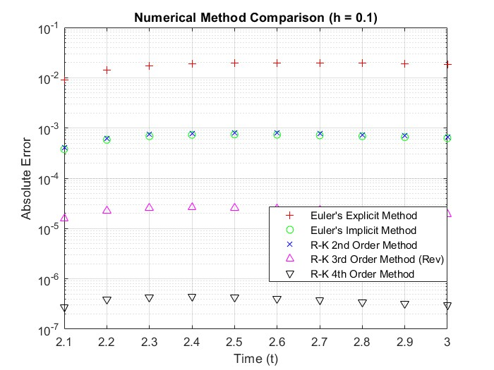
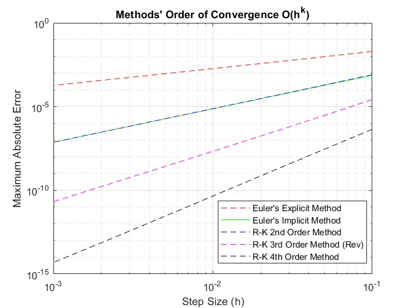

# Problem Set 2: Time Integration Methods for ODEs

This module explores numerical integration schemes for solving Ordinary Differential Equations (ODEs) and Initial Value Problems (IVPs). The focus is on comparing the stability, accuracy, and convergence order of various explicit and implicit methods.

## The Mathematical Framework

The implemented solvers are designed to approximate the solution to the generic initial value problem:

$$\frac{dy}{dt} = f(t,y), \quad y(t_0) = y_0$$

By discretizing time into steps of size $\Delta t$, the continuous derivative is approximated using forward, backward, or multi-stage Runge-Kutta formulations.

## Implemented Solvers

All source codes are located in the `code/` directory. Each method includes its core functional algorithm and a specific execution script for testing.

### 1. Euler Methods (1st Order)
* **Explicit Euler**: A conditionally stable, forward-difference scheme.
* **Implicit Euler**: An unconditionally stable, backward-difference scheme requiring root-finding (or matrix inversion for linear systems) at each time step.

### 2. Runge-Kutta Methods (2nd, 3rd, and 4th Order)
Multi-stage methods that achieve higher-order accuracy without requiring the calculation of higher derivatives of $f(t,y)$.
* **RK2 (Heun's Method)**: Achieves $\mathcal{O}(\Delta t^2)$ accuracy.
* **RK3**: Achieves $\mathcal{O}(\Delta t^3)$ accuracy.
* **RK4**: The classic fourth-order Runge-Kutta method, achieving $\mathcal{O}(\Delta t^4)$ accuracy, offering an excellent balance between computational cost and precision.

## Convergence and Error Analysis

The repository includes a comprehensive method comparison script (`MethodComparisonEx2_1_Script.m`) that evaluates the global truncation error as a function of the time step size ($\Delta t$). 

As shown in the plots below, the empirical order of convergence perfectly matches the theoretical predictions for each method.

  
  

*(Note: Additional plots for individual method outputs and RK3-specific comparisons are available in the `images/` directory).*

## Documentation
For rigorous mathematical proofs, stability condition derivations, and extended commentary on the results, please refer to `CFD_PS2_Solutions.pdf`.
