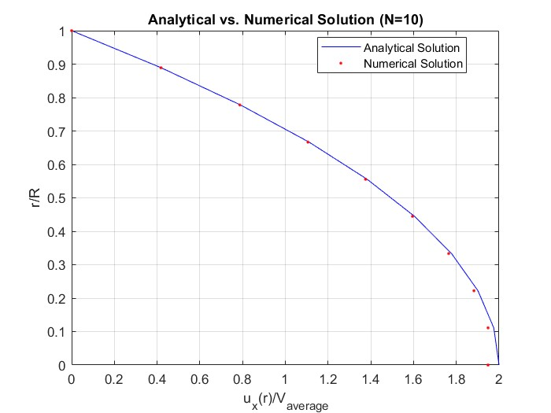
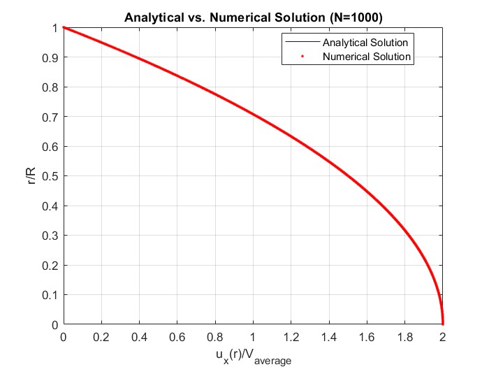

# Problem Set 3: Boundary Value Problems & Poiseuille Flow

This module transitions from initial value problems to Boundary Value Problems (BVPs). It focuses on solving the momentum equation for steady, fully developed laminar flow of an incompressible Newtonian fluid in a cylindrical pipe (Poiseuille flow).

## The Mathematical Framework

The governing 1D momentum equation in cylindrical coordinates simplifies to a second-order ordinary differential equation:

$$\frac{d^2 u_x}{dr^2} + \frac{1}{r} \frac{du_x}{dr} = \frac{1}{\mu} \frac{dp}{dx}$$

To solve this numerically, the domain (from the pipe center $r=0$ to the wall $r=R$) is discretized. The continuous derivatives are approximated using **second-order central finite differences**, transforming the continuous ODE into a system of linear algebraic equations:

$$a_i u_{i-1} + b_i u_i + c_i u_{i+1} = d_i$$

Because this discretization strictly couples adjacent nodes, the resulting coefficient matrix is perfectly tridiagonal.

## Implemented Solvers

All source codes are located in the `code/` directory.

* **`ThomasAlgorithmTriInput.m`**: An optimized implementation of the Thomas Algorithm (TDMA) specifically tailored to accept only the three non-zero diagonals (`a`, `b`, `c`) and the right-hand side vector (`d`). This massively reduces memory overhead compared to passing full $N \times N$ sparse matrices.
* **`ThomasAlgorithmTriInputEx3_1_Script.m`**: Standard BVP solver execution using a 101-node grid.
* **`GridModificationsEx3_1_Script.m`**: Iterates the solver over multiple grid densities to compute and plot the absolute error distribution.
* **`OrderOfConvergenceEx3_1_Script.m`**: Calculates the maximum absolute error for varying grid spacings ($\Delta r$) to empirically verify the $\mathcal{O}(\Delta r^2)$ theoretical truncation error of the central difference scheme.

## Grid Independence & Convergence Study

A rigorous numerical analysis requires proving that the solution is grid-independent. The solver was tested on spatial grids ranging from a highly coarse $N=10$ nodes to a refined $N=1000$ nodes. 

As shown below, while the $N=10$ grid captures the parabolic profile, it lacks the resolution for high precision. At $N=1000$, the numerical solution is practically indistinguishable from the analytical exact solution.

  
  

*(Detailed graphs plotting the absolute error distribution for each specific $N$ value are available in the `images/` directory).*

## Documentation
For the full finite difference stencil derivation, boundary condition handling, and comprehensive error analysis, please refer to `CFD_PS3_Solutions.pdf`.
