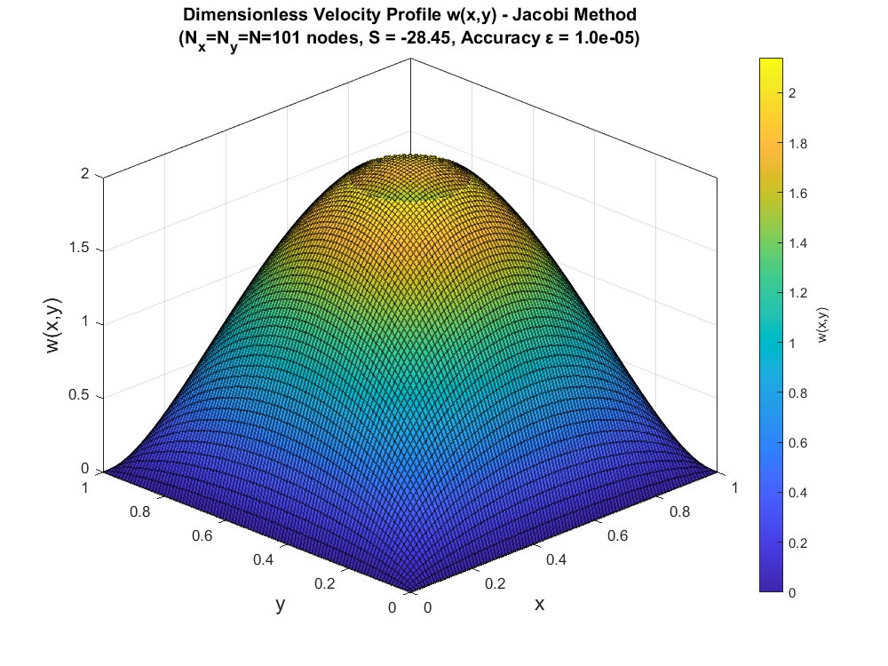

# Problem Set 4: 2D Boundary Value Problems & Vectorized Solvers

This module expands the computational framework from 1D to 2D domains, focusing on solving elliptic Partial Differential Equations (PDEs). Specifically, it models the steady, fully developed laminar flow of an incompressible fluid inside a square duct.

## The Mathematical Framework

The governing 2D momentum equation reduces to the Poisson equation:

$$\frac{\partial^2 w}{\partial x^2} + \frac{\partial^2 w}{\partial y^2} = \frac{1}{\mu} \frac{dp}{dz}$$

Using a uniform 2D grid ($\Delta x = \Delta y = h$), the continuous Laplacian is discretized using a second-order, five-point central difference stencil. This maps the 2D physical domain into a large, sparse system of algebraic equations:

$$w_{i,j-1} + w_{i-1,j} - 4w_{i,j} + w_{i+1,j} + w_{i,j+1} = h^2 S$$

where $S$ is the constant source term dictating the pressure gradient.

## Implemented Solvers & Vectorization

Solving a 2D grid using standard iterative techniques with nested `for` loops drastically degrades performance in MATLAB/Python. To overcome this, the solvers in this module were explicitly **vectorized**.

All source codes are located in the `code/` directory:
* **Standard Iterative Solvers**: `JacobiMethod.m`, `GaussSeidelMethod.m`
* **Vectorized Solvers**: `JacobiMethodV.m`, `GaussSeidelMethodV.m`
  * These scripts separate the coefficient matrix into Diagonal ($D$) and Remainder ($R$) components, executing the iteration matrix algebra globally across the arrays rather than point-by-point. This architectural shift significantly accelerates convergence times for dense grids ($101 \times 101$ nodes).
* **`Ex4_1_Script.m`**: Main execution script orchestrating the grid setup, source term calculation, and solver benchmarking.

## Flow Visualization

The resulting 2D velocity profiles showcase the expected zero-slip boundary conditions at the square duct walls, with the maximum velocity concentrated at the geometric center. Due to mass conservation, the peak velocity in a square duct exceeds that of a circular pipe for the same spatially averaged velocity.

  
  

*(Extended contour maps and cross-sectional profile comparisons are available in the `images/` directory).*

## Documentation
For the complete discretization derivation, stability criteria, and an in-depth physical analysis of the pressure gradient's effect on peak velocity, please refer to `CFD_PS4_Solutions.pdf`.
